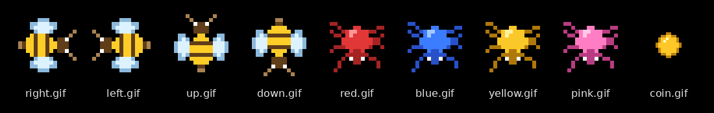

# Game Tutorials

Guides and teacher notes for game projects where students follow a YouTube tutorial.

Each project folder has a teacher page (`README.md`) with:

- the video and other links
- what to set up before class
- the Google Classroom post, ready to copy
- notes on problems in the video

The student guides are in the same folder.

## Projects

| Project | Language and tools | Level | Teacher page |
|---|---|---|---|
| Pac-Man | C#, Visual Studio, Windows Forms | Introduction to C# | [pacman-csharp](pacman-csharp/README.md) |
| Whac-a-Mole | JavaScript, HTML, CSS, VS Code | First JavaScript game (juniors) | [whac-a-mole-js](whac-a-mole-js/README.md) |

## Making Your Own Game Images

Students can design their own characters in Piskel (piskelapp.com), a free pixel-art tool that runs in the browser.

- [Piskel guide for students](piskel/piskelGameImagesGuide.md)
- [Example sprite set](piskel/exampleSprites): an original bee, four spiders, and a coin. The file names match the Pac-Man guide, so the files can replace the Pac-Man images without changing any code.

## Keep This Repo Private

The Pac-Man folder includes an answer key with the complete code (`pacmanCSharpGuide_withFullCode.md`). If you make this repo public, remove that file first.

The tutorial images (the Pac-Man characters and the Mario images) are not stored here. Each teacher page says where to get them.
